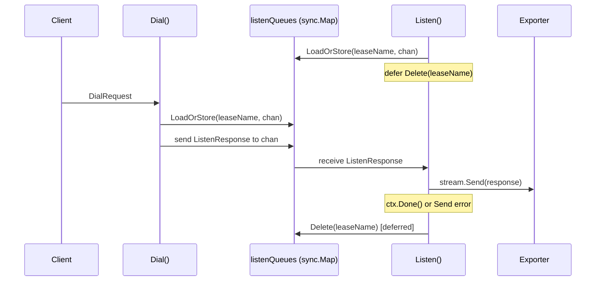

# Design Document: listenQueues Memory Leak Fix

## Overview

Add a deferred cleanup call in `Listen()` to remove the `listenQueues` entry when the listener disconnects. This is a single-line fix (`defer s.listenQueues.Delete(leaseName)`) that leverages Go's `defer` mechanism and `sync.Map`'s thread-safe operations.

## Architecture

The existing architecture is unchanged. The fix adds cleanup to the existing `Listen()` flow:



### Module Responsibilities

1. **ControllerService.Listen()**: Receives dial notifications for a lease via `listenQueues` channel, forwards to exporter gRPC stream. **Now also responsible for cleaning up its `listenQueues` entry on return.**
2. **ControllerService.Dial()**: Creates router tokens and sends dial notifications to `listenQueues` for the target lease. Unchanged.

## Components and Interfaces

No new interfaces. The fix modifies `Listen()` internal behavior only.

### Modified Function

```go
func (s *ControllerService) Listen(req *pb.ListenRequest, stream pb.ControllerService_ListenServer) error {
    // ... authentication, validation (unchanged) ...

    queue, _ := s.listenQueues.LoadOrStore(leaseName, make(chan *pb.ListenResponse, 8))
    defer s.listenQueues.Delete(leaseName)  // NEW: cleanup on disconnect

    for {
        select {
        case <-ctx.Done():
            return nil
        case msg := <-queue.(chan *pb.ListenResponse):
            if err := stream.Send(msg); err != nil {
                return err
            }
        }
    }
}
```

## Data Models

No changes to data models.

## Operational Readiness

- **Observability**: Existing logging in `Listen()` is sufficient. The context cancellation or send error is already visible in logs.
- **Rollout**: Standard deployment. No migration needed.
- **Rollback**: Reverting removes the `defer Delete` line, returning to the leak behavior. No data corruption risk.

## Correctness Properties

### Property 1: Cleanup Guarantee

*For any* `Listen()` call that successfully executes `LoadOrStore`, the `listenQueues` entry for that lease name SHALL be removed when `Listen()` returns.

**Validates: Requirements 1.1, 1.2, 1.3**

### Property 2: Concurrent Safety

*For any* concurrent execution of `Dial()` and `Listen()` cleanup on the same lease name, the system SHALL not panic or deadlock, because `sync.Map` operations (`LoadOrStore`, `Delete`) are individually atomic and thread-safe.

**Validates: Requirements 1.E1, 1.E3**

### Property 3: Functional Preservation

*For any* `Dial()` call where `Listen()` is active and has not yet returned, the `ListenResponse` SHALL be delivered to the listener's gRPC stream via the shared channel.

**Validates: Requirements 2.1, 2.2**

### Property 4: Re-listen Correctness

*For any* sequence where `Listen()` completes cleanup and a new `Listen()` is called for the same lease, the new `Listen()` SHALL create a fresh channel via `LoadOrStore` and function correctly.

**Validates: Requirement 1.E2**

## Error Handling

| Error Condition | Behavior | Requirement |
|----------------|----------|-------------|
| `Listen()` context cancelled | Return nil, defer deletes entry | 01-REQ-1.1 |
| `Listen()` stream.Send fails | Return error, defer deletes entry | 01-REQ-1.2 |
| Concurrent Dial during cleanup | sync.Map handles atomically, no panic | 01-REQ-1.E1 |

## Technology Stack

- **Language**: Go
- **Concurrency primitive**: `sync.Map` (existing)
- **Cleanup mechanism**: `defer` (existing Go idiom)

## Definition of Done

A task group is complete when ALL of the following are true:

1. All subtasks within the group are checked off (`[x]`)
2. All spec tests (`test_spec.md` entries) for the task group pass
3. All property tests for the task group pass
4. All previously passing tests still pass (no regressions)
5. No linter warnings or errors introduced
6. Code is committed on a feature branch and pushed to remote

## Testing Strategy

- **Unit tests**: Directly test that `listenQueues` entries are removed after `Listen()` returns, using a mock gRPC stream and controlled context cancellation.
- **Concurrency tests**: Use goroutines to exercise concurrent `Dial()` and `Listen()` cleanup, verifying no panics or deadlocks.
- **Integration tests**: Existing integration tests in `controller_service_integration_test.go` validate the dial-listen flow end-to-end.
